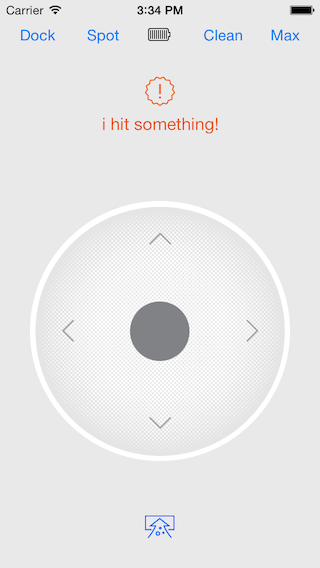

Mr. Sparkle
====================

A Roomba Vacuum Remote Control iOS Application for controlling a Roomba Vacuum connected to a WiFi Dongle such as a WiSnap or WiFly. 

Just join WiFi network created by the WiFi Dongle in your iPhone's Settings, disconnect the Roomba from its charger, and launch the App; you will now be able to drive the Roomba and control the Vacuum from your iPhone! 

Required Parts: 
- Roomba Vacuum with SCI Port 
- WiFi-to-RS232 Dongle (http://goo.gl/C6Pfsc) 
- Roo232 Roomba to Serial RS232 Bridge (http://goo.gl/QV4UwG) 
- A standard 7-pin Male/Male Mini-DIN cable

This App depends on the following static libraries:
 - http://github.com/manybothans/WiFiDongleController
 - http://github.com/manybothans/RoombaController
